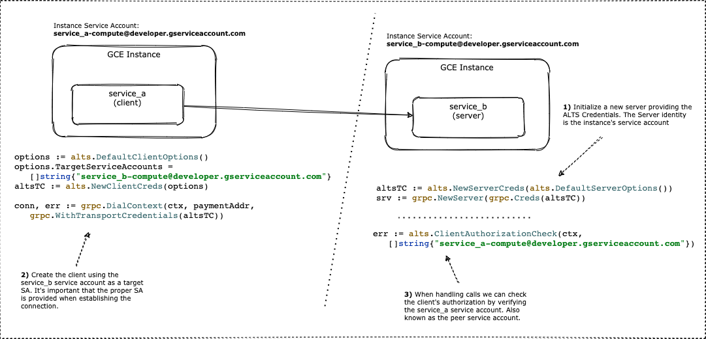
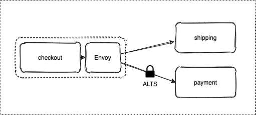

# ALTS Go gRPC with Envoy

In this experiment, we evaluate gRPC authentication in Go using Application Layer Transport Security (ALTS).

To have a comprehensive overview of how ALTS works take a look at the [gRPC ALTS authentication doc page](https://grpc.io/docs/languages/go/alts/).
To have an in-depth understanding of its concepts and design take a look at the [ALTS whitepaper](https://cloud.google.com/security/encryption-in-transit/application-layer-transport-security)

## Quick ALTS Overview

ALTS is used for gRPC service-to-service authentication for applications running on Google Cloud infrastructure.
ALTS will use the server's identity, usually the instance service account, to establish the encrypted communication.

The image below shows a visual explanation of how ALTS works:



## About this Code

In this example, we deploy three services to GKE and establish a secure communication between two of them. See the image
below for more details. 



The `checkout` service uses Envoy as sidecar to handle egress traffic and, instead of implementing the
client ALTS credentials, we use the `type.googleapis.com/envoy.extensions.transport_sockets.alts.v3.Alts` config to allow
the client to authenticate with the server.

Notice that **since the three services are deployed to the same GKE cluster and all nodes have the same Service Account, we
don't need to explicitly provide the service account in the ALTS configuration**. 

## Running the Code

To run this code

Create a GKE cluster and configure your `kubeconfig` to access the new cluster 

```shell
gke_cluster=my-cluster
gke_zone=us-central1-a

gcloud container clusters $gke_cluster --num-nodes 3 --zone $gke_zone
gcloud container get-credentials $gke_cluster --zone $gke_zone
```

Deploy the services to GKE

```shell
kubectl create ns checkout

for s in shipping payment checkout; do
  kubectl apply -f "$s"/.kube.yaml -n checkout
done
```

Before running the client, expose the `checkout` service port

```shell
kubectl port-forward $(kubectl get pods -n checkout -l app=checkout -o jsonpath="{.items[0].metadata.name}") 50054:50054 -n checkout
# keep this session running
```

Run the client

```shell
cd client
go build
go run main.go
```

### Re-building things

If you make changes to the code, re-build and push the new image. 
Example:

```shell
cd checkout
docker build -t your_dockerhub_account/alts-checkout:v1 .
docker push your_dockerhub_account/alts-checkout:v1

# Remember to update the image in the .kube.yaml file and apply 
```

If you make changes in the protobuf, re-build it:

```shell
# Install the protoc in a local folder
./install_protoc_grpc_go.sh

# Generate the stubs for all services
./protogen
```

## A note on GKE Workload Identity

As per today, it seems that ALTS does not support the [workload identity](https://cloud.google.com/kubernetes-engine/docs/how-to/workload-identity)
feature.

## References

These are some resources that helped me during this experiment:

* https://grpc.io/docs/protoc-installation/
* https://grpc.io/docs/languages/go/alts/
* https://github.com/grpc/grpc-go/tree/master/examples/features/encryption/ALTS
* https://github.com/GoogleCloudPlatform/microservices-demo
* https://www.envoyproxy.io/docs/envoy/latest/api-v3/extensions/transport_sockets/alts/v3/alts.proto
* https://cloud.google.com/security/encryption-in-transit/application-layer-transport-security/
* https://www.envoyproxy.io/docs/envoy/latest/start/docker
* https://cloud.google.com/blog/topics/developers-practitioners/health-checking-your-grpc-servers-gke
* https://github.com/envoyproxy/envoy/blob/main/examples/grpc-bridge/server/envoy-proxy.yaml
* https://medium.com/google-cloud/grpc-application-layertransport-security-alts-helloworld-f26e4b05f329
